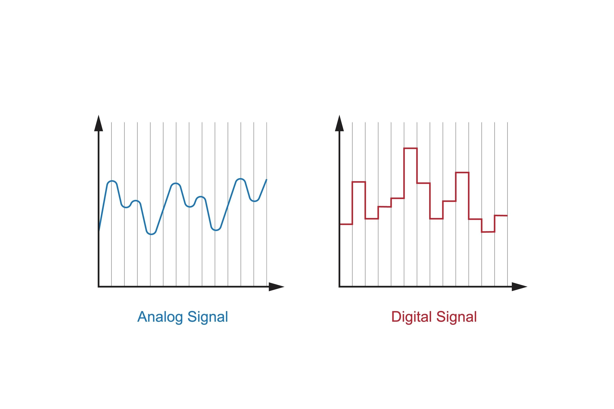

Here is Chapter 1 of **"Modeling Financial Chaos."**

This chapter establishes the foundational problem: *Why do the most powerful AI models in the world—which can write poetry and generate code—fail so consistently when managing a portfolio?*

***

# Chapter 1: The Failure of "Static" Time
### Why Transformers and LSTMs struggle to model the physics of financial markets

To a Data Scientist, a financial chart looks enticingly like a sentence.

In Natural Language Processing (NLP), a sentence is a sequence of tokens: $[x_1, x_2, x_3, ...]$. If you see the sequence *"The quick brown fox jumps over the..."*, your brain (and your model) knows with near-certainty that the next token is *"dog"*. The relationship is static; the grammar of English does not change between Tuesday and Wednesday.

Consequently, the dominant approach in quantitative finance for the last decade has been **"Tokenization."**
1.  Take a time series of asset prices.
2.  Chop it into discrete steps (tokens).
3.  Feed it into a sequence model (LSTM or Transformer).
4.  Predict the next token ($P_{t+1}$).

This approach rests on a fatal assumption: **That time in markets is equivalent to position in a sentence.**

It is not. Financial time is not static; it is fluid and chaotic. A 1% drop in a low-volatility regime (e.g., 2017) means something mathematically different than a 1% drop in a high-volatility regime (e.g., March 2020). When we force financial data into architectures built for static language, we introduce two critical failures: the **Noise Amplification** of Transformers and the **Memory Decay** of LSTMs.

This chapter explores why these architectures fail, paving the way for the State Space Model (SSM) as the necessary solution.

---

## 1.1 The Transformer Fallacy: Attention is (Too Much) Noise

The Transformer architecture (the "T" in GPT) revolutionized AI by introducing the **Self-Attention Mechanism**.

### The Mechanism
In a Recurrent Neural Network (RNN), data is processed sequentially (Step 1, then Step 2). The Transformer broke this constraint by looking at *all data points simultaneously*. It calculates an "Attention Score" between every single pair of tokens in the sequence.

Mathematically, for a sequence of length $N$, the attention mechanism performs matrix multiplication:

$$\text{Attention}(Q, K, V) = \text{softmax}\left(\frac{QK^T}{\sqrt{d_k}}\right)V$$

Where $Q$ (Query), $K$ (Key), and $V$ (Value) are representations of the input data.

### The Financial Problem: $O(N^2)$ Noise
The term $QK^T$ represents the correlation of *every* time step with *every other* time step.
* **In Language:** This is brilliant. The word "bank" at the end of a sentence might depend on the word "river" at the beginning. Every connection matters.
* **In Finance:** This is dangerous. Financial data has a low Signal-to-Noise Ratio (SNR). If you feed 1,000 minutes of price data into a Transformer, it calculates $1,000 \times 1,000 = 1,000,000$ interactions.

Most of these 1 million interactions are **spurious correlations**—random noise that looks like a pattern by pure chance. The Transformer, designed to find connections at all costs, will "overfit" to this noise. It might conclude that *"Price goes up at 10:00 AM because it went down at 9:43 AM,"* when in reality, that relationship is pure coincidence.

**Key Takeaway for Architects:**
The computational complexity of Attention is Quadratic ($O(N^2)$).
* **Scenario:** You want to train a model on high-frequency tick data (1 million ticks).
* **Result:** A Transformer requires $10^{12}$ computations per layer. It is computationally infeasible to give a Transformer a "long memory" of tick data without massive, expensive hardware. You are forced to truncate history, losing the long-term context required for regime detection.

---

## 1.2 The Memory Problem: Why LSTMs "Forget" the Crash

Before Transformers, the industry standard was the **Long Short-Term Memory (LSTM)** network. LSTMs were explicitly designed to solve the memory problem of basic RNNs using a "Forget Gate."

### The Mechanism
The LSTM processes data sequentially. At each step $t$, it updates a hidden cell state $C_t$ and passes it to step $t+1$.
$$C_t = f_t \odot C_{t-1} + i_t \odot \tilde{C}_t$$
Where $f_t$ is the "forget gate" (a number between 0 and 1) that decides how much of the past to keep.

### The Financial Problem: Vanishing Gradients
While better than simple RNNs, LSTMs still suffer from **Information Decay**.
If you train an LSTM on hourly data, a sequence of 1 year is roughly $24 \times 252 \approx 6,000$ steps.
When the model tries to relate an event at Step 6,000 (today) to an event at Step 1 (a year ago), the gradient signal must traverse 6,000 multiplication operations during backpropagation.

If the forget gate $f_t$ is even slightly less than 1.0 (e.g., 0.99), the information decays exponentially:
$$0.99^{6000} \approx 6 \times 10^{-27}$$

The information effectively vanishes.

**Scenario:**
Imagine a **Liquidity Crisis**. The last major one was years ago.
* When a crisis begins *today*, the LSTM sees volatility.
* However, its "memory" of the *mechanics* of the last crisis (years ago) has decayed to zero.
* The model treats the current volatility as a standard Gaussian anomaly rather than a structural regime shift. It "buys the dip" because it has forgotten that in a crisis, dips keep dipping.

---

## 1.3 The Paradigm Shift: Continuous vs. Discrete Time

Both Transformers and LSTMs treat time as **Discrete Steps** (Index 1, Index 2, Index 3).
But financial markets are **Continuous Dynamical Systems**.
* Prices exist between ticks.
* Information flows continuously, even when the market is closed.
* Regime shifts (Phase Transitions) are physics-based phenomena, not sequence-based phenomena.

### Enter the State Space Model (SSM)
To solve the problems of Noise (Transformer) and Memory (LSTM), we must look to **Control Theory** and Physics.

In physics, we describe a moving object not by a list of positions, but by a **State Equation**:
$$h'(t) = \mathbf{A}h(t) + \mathbf{B}x(t)$$

* $h(t)$: The **Hidden State** (The "Phase Space" of the market: Volatility, Momentum, Sentiment).
* $x(t)$: The **Input** (Price, Volume).
* $\mathbf{A}$: The **System Matrix** (The "Physics" or rules of the market).
* $h'(t)$: The rate of change (The derivative).

**Why is this better?**
1.  **Infinite Memory:** In a continuous equation, the state $h(t)$ is a function of *all* history compressed into a vector. It does not "forget" exponentially; it evolves.
2.  **Discretization ($\Delta$):** To use this on a computer, we "discretize" it. We sample the continuous physics at step size $\Delta$.

This parameter, **Delta ($\Delta$)**, is the magic key.
* In a **Standard SSM**, $\Delta$ is fixed.
* In **Mamba (Selective SSM)**, the model *learns* to change $\Delta$ dynamically.

When the market is boring (sideways), Mamba can increase $\Delta$ (take a "coarse" look, ignoring noise). When a crash starts, Mamba can shrink $\Delta$ (take a "fine-grained" look), effectively slowing down its internal clock to process the chaotic information density.

### Chapter Summary

| Feature            | Transformer                    | LSTM                      | State Space Model (Mamba) |
| :----------------- | :----------------------------- | :------------------------ | :------------------------ |
| **View of Time**   | All-at-once (Static)           | Sequential (Discrete)     | **Continuous Flow**       |
| **Complexity**     | Quadratic $O(N^2)$ (Slow)      | Linear $O(N)$ (Fast)      | **Linear $O(N)$ (Fast)**  |
| **Noise Handling** | Overfits Spurious Correlations | Forgets Long-term Context | **Selectively Filters**   |
| **Suitability**    | Language / Image               | Short Sequences           | **Chaotic Time Series**   |

**The Verdict:**
Software Architects and Data Scientists have spent years trying to force financial pegs into NLP holes. To build a robust Regime Detector, we must abandon the idea of "predicting the next token" and embrace the idea of "modeling the underlying physics."

In **Chapter 2**, we will leave the architecture behind momentarily to understand that physics. We will define **Financial Chaos**, visualize the **Attractor**, and mathematically define what a "Regime" actually is.