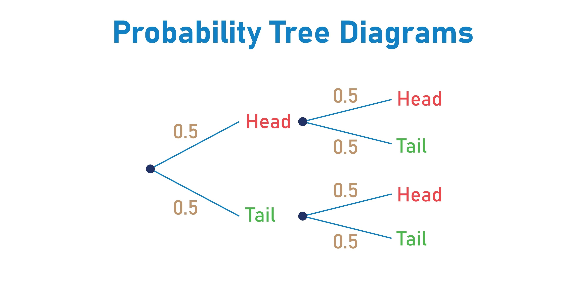

Here is **Chapter 3** of "Modeling Financial Chaos."

This chapter opens the "Black Box" of the Mamba architecture. It translates the complex math of Control Theory into the practical language of Software Architecture, explaining exactly *how* Mamba achieves what Transformers cannot: filtering noise and learning physics.

***

# Chapter 3: The Mamba Architecture
### Selective State Spaces: The Hardware-Aware Math of Regime Detection

In Chapter 1, we established that Transformers fail in finance because they pay attention to *everything* ($O(N^2)$ complexity), drowning in noise.
In Chapter 2, we established that markets are chaotic systems defined by **Attractors**, and a "Regime Change" is a jump from one attractor to another.

Now, we introduce the solution: **Mamba (Selective State Space Model).**

To a Software Architect, Mamba is not just "another neural network." It is a fundamental redesign of how sequential data is processed. It combines the **training speed of Transformers** (Parallelizable) with the **inference efficiency of RNNs** (Constant Memory), while adding a novel "Selection Mechanism" that acts as a programmable gate for financial noise.

This chapter breaks down the three core innovations of Mamba that make it the superior engine for financial chaos:
1.  **The Selection Mechanism:** The "Gate" that filters chop.
2.  **Discretization ($\Delta$):** The "Variable Clock" that adapts to volatility.
3.  **The Parallel Scan:** The "GPU Hack" that enables massive context windows.

---

## 3.1 The "Selection" Mechanism: A Programmable Noise Filter

The fatal flaw of standard State Space Models (SSMs) and legacy RNNs is that they are **Linear Time Invariant (LTI).**
* **Invariant** means the rules don't change over time. The model processes the "Sideways Chop" of a lunch hour with the exact same weight as the "Flash Crash" of a CPI release.
* **The Result:** The model's memory gets clogged with useless noise, leaving no capacity to remember the structural setup of the crash.

### The Mamba Innovation: $B$ and $C$ become $B(x)$ and $C(x)$
Mamba changes the standard equation. It makes the system matrices **functions of the input ($x_t$).**

**Standard SSM:**
$$h'(t) = \mathbf{A}h(t) + \mathbf{B}x(t)$$
*(Matrix $\mathbf{B}$ is static. It lets all data in equally.)*

**Selective SSM (Mamba):**
$$h'(t) = \mathbf{A}h(t) + \mathbf{B}(x_t)x(t)$$
*(Matrix $\mathbf{B}$ changes based on the input!)*

### The Financial Analogy: The "Smart" Order Router
Imagine an Order Router in a High-Frequency Trading (HFT) stack.
* **Standard Router:** Logs every single tick to the database. The disk fills up with noise.
* **Selective Router (Mamba):** Look at the tick.
    * *Is it noise?* (Bid/Ask bounce). **Action:** Set $\mathbf{B} \approx 0$. Ignore it. Do not update the hidden state.
    * *Is it signal?* (Large block trade breaks resistance). **Action:** Set $\mathbf{B} > 0$. Open the gate. Update the hidden state $h(t)$ to reflect this new reality.

**Why this matters for Regime Detection:**
Mamba effectively learns to **"compress"** time. It can ignore 3 months of sideways consolidation (treating it as "one event") while effectively zooming in on 3 milliseconds of a breakout. This allows it to preserve its memory capacity for the events that actually shift the attractor.

---

## 3.2 Discretization ($\Delta$): The Variable Sample Rate

In the continuous math of physics, time flows smoothly ($dt$). On a GPU, we must chop time into discrete steps ($\Delta$).
In Mamba, $\Delta$ is not a fixed hyperparameter (like "1 minute"). It is a **learnable parameter** that varies per token.

$$\bar{A} = \exp(\Delta \cdot A)$$

### The Concept: "Linger Time"
Think of $\Delta$ as **"Linger Time"** or **"Information Density."**
* **Small $\Delta$:** The model steps quickly. "This data point is transient; don't let it affect the long-term state much."
* **Large $\Delta$:** The model lingers. "This data point is momentous. Let it soak into the hidden state $h(t)$ and fundamentally change the trajectory."

### Handling Volatility
In finance, volatility *is* information density.
* **Low Volatility (Lunchtime):** Information density is low. Mamba learns to predict a small $\Delta$, effectively "skipping" over these periods in the state-space evolution.
* **High Volatility (Market Open):** Information density is infinite. Mamba predicts a large $\Delta$, ensuring the state vector swings violently to match the new market physics.

**Architectural Implication:**
This allows Mamba to handle **Asynchronous Data** better than Transformers. Even if you feed it irregular tick data (where 1 tick can be 1ms or 10s), the $\Delta$ parameter normalizes the "physics" of the flow.

---

## 3.3 The Parallel Scan: The "GPU Hack"

If Mamba is a Recurrent model (like an RNN), shouldn't it be slow to train?
* **RNNs are Sequential:** You must calculate Step 1 to get Step 2. You cannot use the thousands of cores on an NVIDIA H100.
* **Transformers are Parallel:** You calculate the $QK^T$ matrix all at once. This is why they dominated... until now.

Mamba solves this using the **Parallel Associative Scan (Prefix Sum)** algorithm.

### The "Cumulative PnL" Analogy
Imagine you have a spreadsheet with daily returns, and you want to calculate the **Cumulative PnL** for 1,000 days.
* **Sequential (RNN style):**
    * Row 2 = Row 1 + Daily2
    * Row 3 = Row 2 + Daily3
    * *Constraint:* You cannot calculate Row 1000 until Row 999 is done.
* **Parallel Scan (Mamba style):**
    Because addition is **Associative** $(a+b)+c = a+(b+c)$, you can break the 1,000 days into pairs.
    1.  **Step 1 (Parallel):** Calculate (Day 1+2), (Day 3+4), ..., (Day 999+1000). *500 ops happen instantly on 500 cores.*
    2.  **Step 2 (Parallel):** Add the results of the pairs.
    3.  **Step 3 (Parallel):** Continue merging.

This algorithm reduces the time complexity from $O(N)$ (Linear) to $O(\log N)$ (Logarithmic) on a GPU.

**The Result:**
Mamba trains **5x faster** than a Transformer on long sequences (e.g., 1M tokens).
For a quantitative researcher, this means you can train on **Tick-Level Data** (millions of steps) instead of daily candles, capturing the "micro-structure" of chaos without waiting weeks for the model to converge.

---

## 3.4 Summary: The Perfect Engine for Chaos

We now have the complete picture of the "Mamba Engine":
1.  **Input:** Raw Financial Time Series.
2.  **Selection ($\mathbf{B}(x)$):** Filters out the noise (sideways chop).
3.  **Discretization ($\Delta$):** Adjusts the "clock" based on volatility.
4.  **State Update ($h_t$):** Evolves the position on the "Attractor" manifold.
5.  **Parallel Scan:** Executes the math at lightning speed on GPUs.

This architecture is not just an improvement; it is a **category killer** for chaotic time series. It respects the physics of the market while running at the speed of modern AI.

In **Chapter 4**, we will leave the theory behind and enter the laboratory. We will build the **"Synthetic Reality"**—generating the Heston Model data that will serve as the training ground for our Mamba Regime Detector.