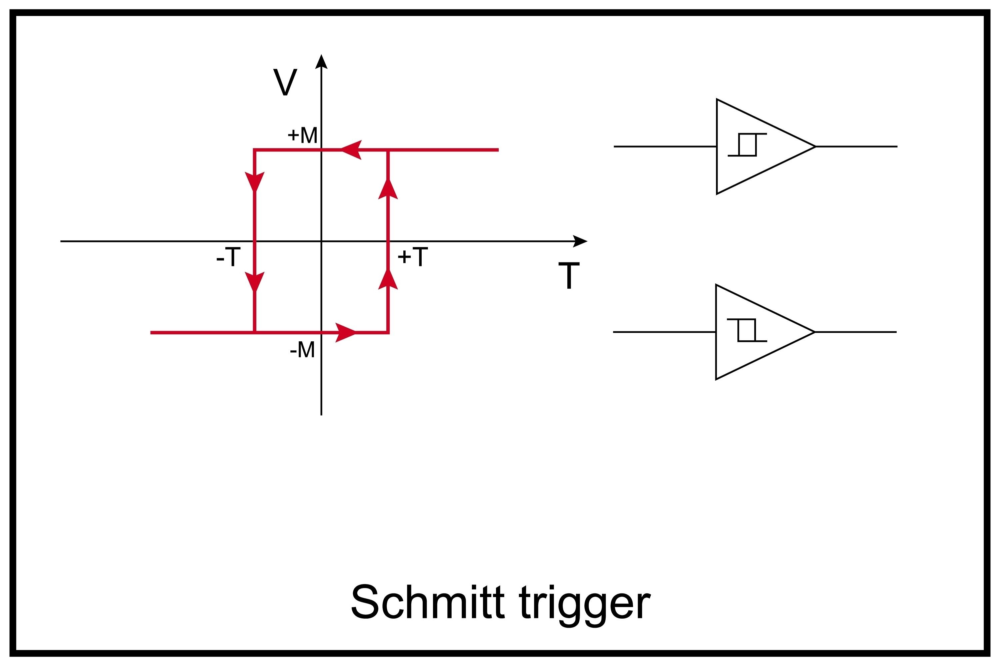

Here is **Chapter 8** of "Modeling Financial Chaos."

This chapter deals with **Execution Reality**.
In a vacuum (academic paper), a signal that flips 50 times a day is fine. In the real market, where every trade costs money (Spread + Fees + Slippage), a flickering signal is a bankruptcy machine.

For the Software Architect, this chapter introduces **State Machine Design**. We treat the trading strategy not as a continuous prediction, but as a Discrete Finite State Machine (FSM) with "Debouncing" logic.

-----

# Chapter 8: Signal Processing and Hysteresis

### The Art of Doing Nothing: Filtering Noise to Save the PnL

We have a Mamba model that predicts the market state. We have a K-Means algorithm that classifies that state as "Safe" (0) or "Dangerous" (1).

If you connect this directly to a trading bot, you will likely lose money.

Why? Because of **Boundary Flicker**.
Imagine the decision boundary between the "Bull" cluster and the "Bear" cluster. In the Phase Space, this is a specific line (or hyperplane).
When the market is transitioning, the hidden state $h_t$ often hovers right on this line.

  * **10:00 AM:** State crosses line $\to$ Signal: **BEAR**. (Sell Everything).
  * **10:01 AM:** State drifts back 0.01 units $\to$ Signal: **BULL**. (Buy Everything).
  * **10:02 AM:** State crosses again $\to$ Signal: **BEAR**. (Sell Everything).

In 3 minutes, you have paid the spread and exchange fees three times, but the market hasn't actually moved. This is called "The Whipsaw."

To solve this, we borrow a concept from Electrical Engineering: **Hysteresis** (or the Schmidt Trigger). We must decouple the **Raw Signal** from the **Allocated State**.

-----

## 8.1 The Cost of Flicker

Before fixing it, we must quantify the damage.
Let’s assume a standard fee structure (e.g., crypto exchange or institutional broker):

  * **Taker Fee:** 0.05%
  * **Bid-Ask Spread:** 0.01%
  * **Total Cost per Round Trip:** $(0.05\% + 0.01\%) \times 2 = 0.12\%$.

If your model "flickers" just once a day during a transition week:
$$Loss = 0.12\% \times 5 \text{ days} = 0.6\% \text{ per week}$$
$$Annualized \text{ Drag} = 0.6\% \times 52 \approx 31\%$$

Your AI model could be 80% accurate, but if it flickers, you will lose 31% of your portfolio to fees alone. We need the model to be **"Lazy."** It should only trade when it is *overwhelmingly* sure.

-----

## 8.2 The Solution: The Schmidt Trigger (Hysteresis)

In analog electronics, a Schmidt Trigger converts a noisy sine wave into a clean square wave. It does this by having two different thresholds:

1.  **Turn ON** only when voltage crosses 5V.
2.  **Turn OFF** only when voltage drops below 3V.



In Trading, we apply this to **Time**.
We require a **Confirmation Buffer**.

  * **Rule:** "I will not switch from Bull to Bear until I see $N$ consecutive 'Bear' signals from Mamba."

This introduces **Lag** (we react $N$ minutes late), but it eliminates **Noise** (we don't react to 1-minute spikes). In Regime Modeling, this trade-off is nearly always worth it.

-----

## 8.3 Implementation: The `RegimeFilter` Class

We implement this as a Python class that acts as a wrapper around the K-Means output. This class maintains the "State" of the portfolio.

```python
class RegimeFilter:
    def __init__(self, confirm_threshold=3):
        """
        A Hysteresis State Machine.
        
        Args:
            confirm_threshold (int): The number of consecutive signals required 
                                     to flip the portfolio state.
        """
        self.threshold = confirm_threshold
        
        # The 'Actual' State of the portfolio (0 or 1)
        self.state = 0 
        
        # The counter for the incoming signal stream
        self.buffer_counter = 0
        self.pending_signal = 0

    def update(self, raw_signal):
        """
        Process a new raw signal from Mamba/K-Means.
        Returns the filtered Portfolio State.
        """
        # Case 1: The new signal agrees with our current state.
        # Action: Relax. Reset the counter.
        if raw_signal == self.state:
            self.buffer_counter = 0
            self.pending_signal = raw_signal
            return self.state

        # Case 2: The new signal disagrees (Potential Regime Change).
        # Action: Be skeptical. Increment counter.
        else:
            # If this is a NEW disagreement, start counting
            if raw_signal != self.pending_signal:
                self.pending_signal = raw_signal
                self.buffer_counter = 1
            else:
                # If it's the SAME disagreement as last tick, keep counting
                self.buffer_counter += 1
            
            # Check if evidence is sufficient to switch
            if self.buffer_counter >= self.threshold:
                print(f"  >>> CONFIRMED SWITCH: State {self.state} -> {raw_signal}")
                self.state = raw_signal
                self.buffer_counter = 0 # Reset
                
            return self.state
```

-----

## 8.4 Advanced Tuning: Asymmetric Hysteresis

A novice trader treats Buying and Selling symmetrically.
A veteran knows that **Fear is faster than Greed.**

  * Markets fall faster than they rise.
  * Panics happen in minutes; recoveries take months.

Therefore, our filter should be **Asymmetric**.

**The "Fast-Out, Slow-In" Logic:**

1.  **Exit Strategy (Bull $\to$ Bear):** We want to leave *fast*.
      * Set Threshold = 1 or 2.
      * *Logic:* "If Mamba detects a crash, believe it immediately. Better to be safe than sorry."
2.  **Entry Strategy (Bear $\to$ Bull):** We want to enter *slow*.
      * Set Threshold = 5 or 10.
      * *Logic:* "Don't catch a falling knife. Wait until the market is undeniably stable before risking capital again."

### Modified Code Snippet

```python
    def get_dynamic_threshold(self, current_state):
        if current_state == 0: 
            # We are currently Long (Bull). 
            # We want to protect capital, so we switch to Bear EASILY.
            return 2 
        else:
            # We are currently Cash/Short (Bear).
            # We want to be careful re-entering.
            return 6
```

-----

## 8.5 Visualizing the Difference

Let's visualize how this filter changes the signal profile.

  * **Top Plot (Raw Mamba):** The grey line. It looks like a barcode scanner—lots of thick black blocks where the signal flips rapidly. Each flip is a fee.
  * **Bottom Plot (Filtered):** The blue line. It is clean. It stays High for weeks, then drops Low for weeks. The "Barcode" areas are smoothed into single, decisive trades.

**The "Lag Cost":**
Notice that on the Bottom Plot, the Blue line drops slightly *after* the Grey line starts flickering.
This delay is the **Insurance Premium** you pay to avoid Whipsaws. In a major crash (e.g., -30%), missing the first 1% (the lag) is a negligible price to pay for avoiding the noise.

-----

## 8.6 Summary: The System is Stable

We have transformed a "prediction" into a "strategy."

1.  **Mamba** provides the raw intuition (Physics).
2.  **K-Means** digitizes the intuition (Signal).
3.  **Hysteresis** stabilizes the signal (Execution).

Now, and only now, is the system robust enough to be backtested against historical data. We are ready to see if this architecture actually makes money.

In **Chapter 9**, we will build the **Anchored Walk-Forward Backtest Engine**. We will simulate the passage of 10 years of trading, accounting for re-training, fees, and the hysteresis lag we just engineered.