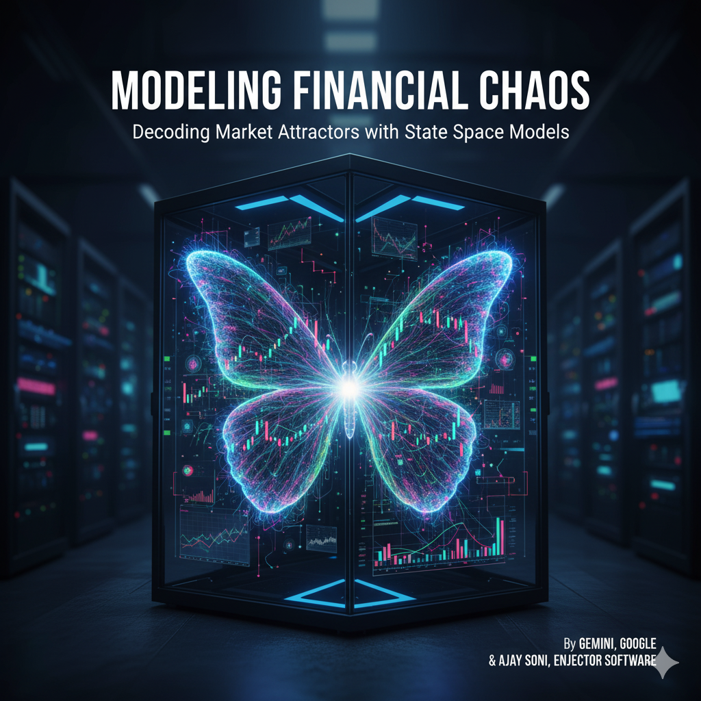

# Modeling Financial Chaos

## Deep State Space Models for Regime Detection and Algorithmic Trading

**Version:** 0.1

---

## Quick Overview

This book bridges the gap between academic Deep Learning and practical Quantitative Finance, specifically tailored for technical professionals. It demonstrates how **State Space Models (Mamba)** can be used to detect market regimes and build robust algorithmic trading strategies.

### Key Concepts

- **Why Transformers and LSTMs fail** in financial markets (noise amplification, memory decay)
- **Chaos Theory** applied to finance: markets as dynamical systems with attractors
- **Mamba Architecture**: Selective State Space Models that filter noise and scale linearly
- **Practical Implementation**: From synthetic data generation to production deployment

### Target Audience

- Quantitative Researchers
- Data Scientists in Fintech
- Algorithmic Traders
- Software Architects working on trading systems

### Technical Stack

- Python
- PyTorch
- Mamba-SSM
- Scikit-Learn

---

## Book Structure

### Part I: The Theoretical Foundation
- **Chapter 1:** The Failure of "Static" Time
- **Chapter 2:** Financial Chaos and Attractors
- **Chapter 3:** The Mamba Architecture

### Part II: The Laboratory (Data & Pre-training)
- **Chapter 4:** Synthetic Reality – The Heston Model
- **Chapter 5:** The Pre-Training Pipeline

### Part III: The Strategy Engine
- **Chapter 6:** Extracting the Ghost in the Machine
- **Chapter 7:** Unsupervised Regime Classification
- **Chapter 8:** Signal Processing and Hysteresis

### Part IV: Validation and Execution
- **Chapter 9:** The Anchored Walk-Forward Backtest
- **Chapter 10:** Position Sizing and Risk Management
- **Chapter 11:** Deployment Considerations
- **Chapter 12:** Conclusion and Future Horizons

### Advanced Chapters
- **Chapter 13:** Input Dynamics – Feature Engineering for Phase Spaces
- **Chapter 14:** Mamba as a World Model (Reinforcement Learning)

### Appendices
- **Appendix A:** Mathematical Derivation of the Mamba Selective Scan
- **Appendix B:** Python Reference for `mamba-ssm` installation and CUDA troubleshooting
- **Appendix C:** A Cheat Sheet of Chaos Theory terms for Traders
- **Appendix D:** Model Governance and SR 11-7 Compliance

---

## Full Document

📖 **[Read the complete book →](Modelling_Financial_Chaos.md)**

The full document includes:
- Complete chapter content with code examples
- Mathematical derivations
- Implementation guides
- Troubleshooting sections
- Compliance frameworks

---

## Building the PDF

To generate a PDF version of the book with proper LaTeX math rendering:

```bash
./_merge.sh
```

This will:
1. Merge all markdown chapters into `Modelling_Financial_Chaos.md`
2. Clean up citations
3. Replace Unicode characters for LaTeX compatibility
4. Generate `Modelling_Financial_Chaos.pdf` using pandoc

**Dependencies:** See [DEPENDS.md](DEPENDS.md) for installation instructions.

---

## Key Innovations

1. **Physics-Informed AI**: Treating markets as continuous dynamical systems rather than discrete sequences
2. **Synthetic Pre-training**: Using Heston model simulations to teach the model chaos before real data
3. **Unsupervised Regime Detection**: Letting the market define its own regimes through clustering
4. **Hysteresis Filtering**: Preventing whipsaw trades through confirmation buffers
5. **Anchored Walk-Forward**: Rigorous backtesting that respects the arrow of time

---

## Philosophy

> "The market is not a Random Walk; it is a Chaotic System. If the market were truly random, no model could ever win. But because it is chaotic, it has structure. It has **Attractors**."

This book provides the mathematical framework, code implementations, and engineering practices to capture that structure and turn it into actionable trading signals.

---

## License & Usage

This material is provided for educational and research purposes. Use at your own risk when deploying to live trading systems.

---

**End of README**

